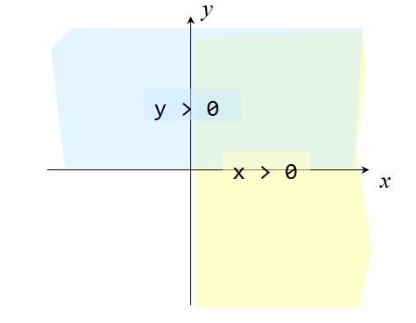
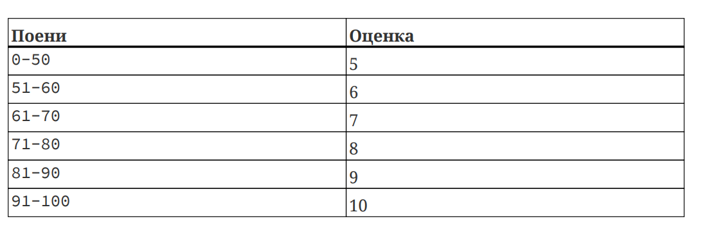
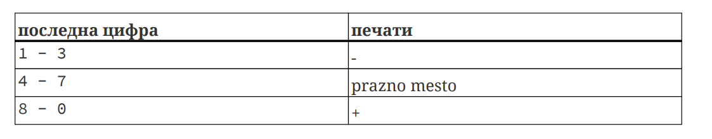

## Conditionals

### Task 1

Write a program that reads a character from the keyboard and prints 1 if it is a lowercase letter or 0 if it is an uppercase letter.

Bonus: Check if the character is a digit.

### Task 2

The coordinates of a point on a plane are entered from the keyboard. Write a program that will print to which quadrant the entered point belongs.

### Task 3

Write a program that will generate an appropriate grade for an entered number of points from an exam according to the following table:

Modify the previous program so that in addition to the grades, it will also print the signs `+` and `-` depending on the value of the last digit of the points:

Example:

`81 = 9-    94=10     68 = 7+`

The `+` or `-` sign should not be added for the grade 5, and the + sign should not be added for the grade 10.

### Task 4

Write a program to calculate the age of a dog in human years. The dog’s age is read from standard input.

If a negative number is entered for the age, print the following message: “Age must be a positive number”.

Note: For the first two years, one dog year is equal to 10.5 human years. After that, each dog year is equal to 4 human years.

### Task 5

Write a program that will print the maximum of two numbers whose values are read from the keyboard.

### Task 6

Write a program that checks if a given year, read from the keyboard, is a leap year or not and prints an appropriate message.

Examples of leap years: 1976, 2000, 2004, 2008, 2012…

Hint: A year is a leap year if it is divisible by 4 but not divisible by 100, or if it is divisible by 400.

