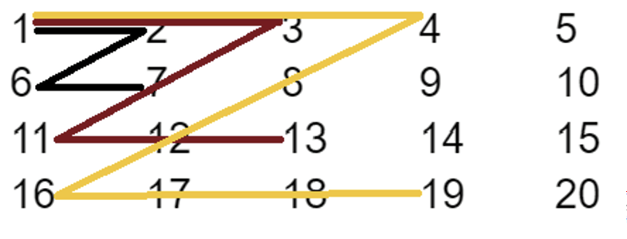
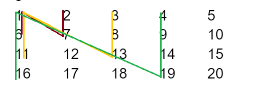
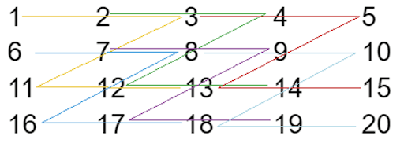
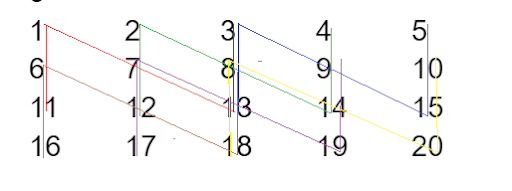

## Task 1 - [Click here for the solution](./question_1.cpp)

From standard input an initial textual string is entered with a maximum length of 50 characters - the starting string.

Then entered a whole number N ($N <= 100$). Following that, for each line, N textual strings (sentences) with a maximum length of 100 characters.


For each of the entered sentences, count how many times the starting string appears in it (case-insensitive). Finally, generate a report that indicates how many sentences have 0, 1, 2, ..., or n occurrences of the starting string. In this case, n is the number of occurrences of the starting string in any of the sentences. The output should be in the format given in the example.


Note: Counting how many times the starting string appears in the sentence should be done in a separate function.

In the output, the first number indicates occurrences of the string 2024 (from 0 to n), and the second number indicates how many sentences from the input have the corresponding number of occurrences of the starting string 2024.

For example:

```
Input	
2024
4
Srekjna Nova Godina!
Srekjkna Nova 2024 godina! Mnogu zdravje, uspeh i srekja vo 2024ta.
2024 e novata godina koja ni pretstoi, Da bide ispolneta so radost i srekja. Srekjna 2024 godina!
Uste edna nova godina ni dojde.

Result
0: 2
1: 0
2: 2
```


## Task 2 - [Click here for the solution](./question_2.cpp)

The dimensions of a matrix Аmxn ($m,n <=100$) are read from the standard input, and then the elements of the matrix. The elements of the matrix are integers.

Print all the sums obtained by writing the pattern for the letter Z in the matrix A. The first pattern is obtained from the submatrix A1 (2x2) starting from index (0,0) in the matrix A, the next submatrix is A2 (3x3) starting from the same from index (0,0) in matrix A etc. See the example below!



For example:
```
Input	
4
5
1 2 3 4 5
6 7 8 9 10
11 12 13 14 15
16 17 18 19 20

Result
16
49
100
```

## Task 3 - [Click here for the solution](./question_3.cpp)


For a given number n, print the following sequence without using loop statements (using recursion): `n n-5 n-10 n-15 … n-15 n-10 n-5 n`

Note: Use spaces between the numbers when printing the sequence.

For example:
```
Input	
16

Result
16 11 6 1 -4 1 6 11 16
```

## Task 4 - [Click here for the solution](./question_4.cpp)

From the standard input, enter an initial textual string with a maximum length of 20 characters - the starting string.

Then, enter a whole number N (`N <= 100`). Subsequently, for each new line, enter N textual strings (sentences) with a maximum length of 150 characters.

For each of the entered sentences, count how many times the starting string appears consecutively in it (case-insensitive). Finally, generate a report that indicates how many sentences have 0, 1, 2, ..., or n consecutive occurrences of the starting string. In this case, n is the number of consecutive occurrences of the starting string in the sentences. The output should be in the format given in the example. 

Note: Counting how many times the starting string appears consecutively in the sentence should be done in a separate function.

In the output, the first number indicates consecutive occurrences of the string 2024 (from 0 to n), and the second number indicates how many sentences from the input have the corresponding number of consecutive occurrences of the starting string 2024.

For example, in the following sentence:
**20242024** e novata godina koja ni pretstoi, Da bide ispolneta so radost i srekja. Srekjna Nova **2024<u>20242024</u>** godina!

the number of consecutive occurrences of the string 2024 is 3 (marked with bold and underlined characters).


For example:
```
Input	
2024
4
Srekjna Nova Godina!
Srekjkna Nova 20242024 godina! Mnogu zdravje, uspeh i srekja vo 2024ta.
20242024 e novata godina koja ni pretstoi, Da bide ispolneta so radost i srekja. Srekjna Nova 202420242024 godina!
Uste edna nova godina ni dojde.

Result
0: 2
1: 1
2: 0
3: 1
```

## Task 5 - [Click here for the solution](./question_5.cpp)

The dimensions of a matrix Аmxn (`m,n <=100`) are read from the standard input, and then the elements of the matrix. The elements of the matrix are integers.

Print all the sums obtained by writing the pattern for the letter N in the matrix A. The first pattern is obtained from the submatrix A1 (2x2) starting from index (0,0) in the matrix A, the next submatrix is A2 (3x3) starting from the same from index (0,0) in matrix A etc. See the example below!




For example:
```
Input	
4
5
1 2 3 4 5
6 7 8 9 10
11 12 13 14 15
16 17 18 19 20

Result
16
49
100
```

## Task 6 - [Click here for the solution](./question_6.cpp)

For a given number n, print the following sequence without using loop statements (using recursion): `n n-3 n-6 n-9 ... n-9 n-6 n-3 n`

Note: Use spaces between the numbers when printing the sequence.

For example:
```
Input
16

Result
16 13 10 7 4 1 -2 1 4 7 10 13 16
```

## Task 7 - [Click here for the solution](./question_7.cpp)

From standard input, enter an integer N (`N<=100`), followed by N textual strings (sentences) with a maximum length of 100 characters each, each specified on a new line.

For each of the entered sentences, count how many total consecutive occurrences of consonants appear. Finally, generate a report that indicates how many sentences have 0, 1, 2, ..., or n consecutive occurrences of consonants. In this case, n is the maximum number of consecutive occurrences of consonants in any of the sentences.


The output should be in the format as given in the example.

Note: Counting consecutive occurrences of consonants in the sentence should be done in a separate function.


In the output, the first number represents consecutive occurrences of consonants (from 0 to n), and the second number indicates how many sentences from the input have the corresponding number of consecutive occurrences of consonants.

For example, in the sentence:


U**st**e e**dn**a nova godina ni do**jd**e.

the number of consecutive occurrences of consonants is: 3 (highlighted with bold letters).


For example:
```
Input	
4
Srekjna Nova Godina!
2024 e novata godina koja ni pretstoi, Da bide ispolneta so radost i srekja. 
Uste edna nova godina ni dojde.
2024taaaaa

Result
0: 1
1: 0
2: 1
3: 1
4: 0
5: 0
6: 0
7: 1
```

## Task 8  - [Click here for the solution](./question_8.cpp)

From the standard input, the dimension of one matrix Amxn ($m,n<=100$) is given, and then the elements of the matrix are read. The elements of the matrix are integers. After the matrix values, another integer (representing the size of the letter Z) is entered.

Create a new matrix M whose elements are obtained as sums of the elements that lie on the sides/contours of the letter Z (the length of the sides of the letter Z - that is, the number of elements that should be taken into account is entered as a command line parameter) . Each element of the new matrix (Mij) is equal to the sum of the elements found in the path to form the letter Z starting from the corresponding element in the matrix A. The elements for which the letter Z cannot be formed remain the same in the newly created matrix.

Print the newly obtained matrix M to the standard output.

The way in which the elements of the new matrix are obtained is represented in the image with different colors:



```
49 = 1+2+3+7+11+12+13
56 = 2+3+4+8+12+13+14
98 = 8+9+10+14+18+19+20
```


For example:
```
Input	
4
5
1 2 3 4 5
6 7 8 9 10
11 12 13 14 15
16 17 18 19 20
3

Result
49 56 63 4 5
84 91 98 9 10
11 12 13 14 15
16 17 18 19 20

```
## Task 9 - [Click here for the solution](./question_9.cpp)

For a given string of characters with a maximum length of 100 characters (entered from the keyboard), find and return the first punctuation mark using a recursive function. Print the found punctuation mark on the screen. If none is found, the function should return the  `‘\0’` character.

For example:
```
Input	
daNh5 }cFVfj.aQsC06eTHr;y0;!YZ~S;%cF{

Result
}
```
## Task 10 - [Click here for the solution](./question_10.cpp)


From the standard input, enter an integer N ($N<=100$), followed by N textual strings (sentences) with a maximum length of 100 characters each, each specified on a new line.

For each of the entered sentences, count how many total consecutive occurrences of vowels appear. Finally, generate a report that indicates how many sentences have 0, 1, 2, ..., or n consecutive occurrences of vowels. In this case, n is the maximum number of consecutive occurrences of vowels in any of the sentences.

The output should be in the format as given in the example.

Note: Counting consecutive occurrences of vowels in the sentence should be done in a separate function.

In the output, the first number represents consecutive occurrences of vowels (from 0 to n), and the second number indicates how many sentences from the input have the corresponding number of consecutive occurrences of vowels.

For example, in the sentence:

Uste edna nоv**aааа** g**oоооо**dina ni dojd**eееее**.

the number of consecutive occurrences of vowels is: 3 (highlighted with bold letters).


For example:
```
Input	
4
Srekjna Nova Godina!
2024 e novata godina koja ni pretstoi, Da bide ispolneta so radost i srekja.
Uste edna novaaa gooooodina ni dojdeeeee.
2024taaaaaa

Result
0: 1
1: 2
2: 0
3: 1
```

## Task 11 - [Click here for the solution](./question_11.cpp)

From the standard input, the dimension of one matrix Amxn ($m,n<=100$) is given, and then the elements of the matrix are read. The elements of the matrix are integers. After the matrix values, another integer (representing the size of the letter N) is entered.

Create a new matrix M whose elements are obtained as sums of the elements that lie on the sides/contours of the letter N (the length of the sides of the letter N - that is, the number of elements that should be taken into account is entered as a command line parameter) . Each element of the new matrix (Mij) is equal to the sum of the elements found in the path to form the letter N starting from the corresponding element in the matrix A. The elements for which the letter N cannot be formed remain the same in the newly created matrix.

Print the newly obtained matrix M to the standard output.

The way in which the elements of the new matrix are obtained is represented in the image with different colors:



```
49 = 1+6+11+7+13+8+3
56 = 2+7+12+8+14+9+4
98 = 8+13+18+14+20+15+10
```


For example:
```
Input	
4
5
1 2 3 4 5
6 7 8 9 10
11 12 13 14 15
16 17 18 19 20
3

Result
49 56 63 4 5
84 91 98 9 10
11 12 13 14 15
16 17 18 19 20

```

## Task 12 - [Click here for the solution](./question_12.cpp)

For a given string of characters with a maximum length of 100 characters (entered from the keyboard), find and return the first uppercase letter using a recursive function. Print the found letter on the screen. If there is none, the function should return the `'\0'` character.

For example:
```
Input
daNh5}cFVfj.aQsC06eTHr;y0;!YZ~S;%cF{

Result
N
```