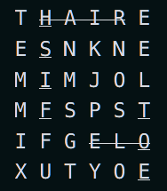

## Task 1

Од стандарден влез се чита цел број N (N<=100) и потоа N низи од знаци. Низите знаци содржат букви, цифри и специјални знаци (без знаци за празно место), а секоја од нив не е подолга од 80 знаци.
Да се напише програма со која што на стандарден излез ќе се отпечати најдолгата низа, којашто е палиндром (се чита исто од од лево на десно и од десно на лево) и што содржи барем еден специјален знак. Ако нема такви низи, се печати "Nema!". Ако има две или повеќе низи што го задоволуваат овој услов, се печати првата низа којашто го задоволува условот.

Input 	
```
9
a!bcdedcb!a
Kfd?vsvv98_89vvsv?dfK
Ccsvsdvdfv
342425vbbcb
352!2353696969625
gdg??dfg!!
5336346644747
8338736767867
12344321
```

Result

`Kfd?vsvv98_89vvsv?dfK`

## Task 2

Од тастатура се чита природен број N (N < 400).

Да се напише програма којашто формира квадратна матрица што ги содржи броевите од 1 до N по растечки редослед на следниот начин: во првата колона во правец од горе надолу, па продолжува во втората колона од долу нагоре, па продолжува во третата колона од горе надолу итн. Да се избере најмалата димензија на матрицата во која ќе ги собере сите броеви до N. Доколку има преостанати празни места, тие да се пополнат со нули.

Input

`22`

Result	
```
1 10 11 20 21
2 9 12 19 22
3 8 13 18 0
4 7 14 17 0
5 6 15 16 0
```

## Task 3

Од стандарден влез се чита цел број N (N<100) и потоа N низи од знаци. Низите знаци содржат букви, цифри и специјални знаци, а секоја од нив не е поголема од 50 знаци.

Да се напише програма што ќе ги отпечати на екран сите низи од знаци во кои се содржи поднизата А1c  најмалку 2 пати (пр. `A1c01АA1c92`, `12A1cwwA1cxy`, `аA1cwA1cA1ccA1cxab`) според редоследот како што се прочитани од влезот. При печатење на зборовите, сите алфабетски знаци треба да се испечатат со мали букви.

Input
```
6
Ekjqh!!lkjsdh 
A1c01АA1c92
12A1cwwA1cxy 
12A1cwwA1bxy 
аA1cwA1cA1ccA1cxab
nemaA1c_povekjepati
```

Output
```
a1c01Аa1c92
12a1cwwa1cxy
аa1cwa1ca1cca1cxab
```

## Task 4

Од тастатура се внесуваат димензиите m и n на матрица од цели броеви, Аmxn, ( 0 < m, n < 30 ) и нејзините елементи. Потоа се внесуваат два цели броја r и k  (индекси на редица/колона од матрицата, т.е. 0 <= r < m и 0 <= k < n).

Да се напише програма која ja трансформира матрицата А така што елементите над редицата r и лево од колоната k се заменуваат со минималната вредност од матрицата А.

Input
```
4 6
2 3
1 2 3 4 5 1             
2 9 4 5 1 3
4 5 6 7 3 2
1 2 3 3 2 8
```

Output
```
1 1 1 4 5 1   
1 1 1 5 1 3
4 5 6 7 3 2
1 2 3 3 2 8
```


## Task 5

Еден елемент се заматува ако се најде аритметичка средина на елементот и сите негови соседи. Сосед на еден елемент се сите елементи кои припаѓаат на матрицата и се  околу истиот елемент (хоризонтално, вертикално и дијагонално). 
Од стандарден влез се чита матрица од реални броеви (3 < n,m < 50). Прво се читаат бројот на редици и колони на матрицата и во секој преостанат ред се внесува еден ред од матрицата (види пример).По читањето на матрицата, се внесуваат и 2 пара координати на матрицата (ред и колона) кои го репрезентираат горниот-лев и долниот-десен елемент од регионот. Потребно е да генеирате нова матрица во која ќе ги заматите сите елементи кои припаѓаат на регионот. 

Новодобиената матрица, во истиот формат, треба да се испечати (види пример).

Input

```
3 3
1 2 3
4 5 6
7 8 9
0 0
2 2
```
Output
```
3 3.5 4
4.5 5 5.5
6 6.5 7
```

## Task 6

Од стандарден влез се чита природен број N (N <= 100), како и низа од позитивни цели броеви a[ ] со N елементи. 

Да се напише функција int par(a, n) која ќе го врати најмалиот елемент во низата кој се појавува парен број пати во низата. Доколку нема таков елемент, функцијата враќа вредност 0.

Напишете програма што ќе ја повика функцијата par за внесената низа a[ ] и ќе го испечати најмалиот број којшто се појавува парен број пати во низата a[].

Input:

12 // бројот N на елементи

1 3 4 5 3 1 4 5 5 3 2 3 // елементи на низата

Output:

Najmaliot element koj se pojavuva paren broj pati e 1 // овде функцијата par враќа вредност 1, а се печати оваа порака


For example:
Input
```
12
1 3 4 5 3 1 4 5 5 3 2 
```
Output
```
Najmaliot element koj se pojavuva paren broj pati e 1
```

---

Input
```
12
7 3 4 5 3 8 1 5 5 3 2 6
```
Output
```
Nitu eden element ne se pojavuva paren broj pati!
```

## Task 7

Од стандарден влез се чита природен број N (N <= 100), како и низа a[ ] од N цели броеви. 

Да се напише функција void premesti(а, n) која го преместува секој пронајден негативен број на крајот на низата. По преместувањето редоследот на позитивните броеви треба да остане ист како и во оригиналната низа, а истото важи и за редоследот на негативните.

Нaпишете програма која ќе ја повика функцијата premesti за внесената низа a[ ] и потоа ќе ја испечати новодобиената низа.

Input
```
9
1 3 -3 2 5 -7 -9 0 3
```
Output
```
1 3 2 5 0 3 -3 -7 -9
```

## Task 8 ****

Четиринасочник претставува матрица во која се испишани зборови хоризонотално и вертикално, одлево-надесно и оддесно-налево. Притоа секој елемент од матрицата претставува буква од англиската азбука.

пример скриени зборови: HAIR, OLE (прецртани), FISH, TOE (подвлечени)



Од стандарден влез се чита квадратна матрица од ред n (3 <= n <= 50), составена од знаци. Прво се чита бројот n - бројот на редици (колони) на матрицата, а потоа и самите елементи на матрицата (види пример).

По читањето на матрицата, од стандарден влез се внесува збор составен од максимум 10 букви.

Ваша задача е да определите дали тој збор се наоѓа во четиринасочникот (хоризонтално или вертикално, одлево-надесно или оддесно-налево). Потребно е да се испечати локацијата (ред, колона) на првата и последната буква од зборот. Доколку зборот повеќепати се наоѓа во четеринасочникот, треба да се испечати првото појавување, гледано елемент по елемент како што се чита матрицата.

Доколку не се пронајде зборот, тогаш се печати **Not Found**.

For example:

Input
```
4
T H K I
E E N K
M A E J
M I E P
KNEE
```
Output
```
0, 2 -> 3, 2
```
---
Input
```
6
T H N I R E 
E E A K N E 
M A M A M A 
M T A P S T 
L R M M L O 
R U A Y O E
MAMA
```
Output
```
2, 0 -> 2, 3
```


## Task 9

Од стандарден влез се внесуваат непознат број на реченици претставени преку текстуални низи (стрингови) секоја не подолга од 100 знаци и секоја во нов ред. Програмата треба да го најде стрингот кој содржи најмногу сврзници и да го испечати заедно со бројот на најдените сврзници. За сврзници се сметаат сите зборови составени од една, две или три букви. Зборовите во текстуалната низа се одделени со едно или повеќе прзани места и/или интерпункциски знак.

Броењето на сврзници во дадена текстуална низа треба да се реализира во посебна функција. Решенијата без користење функција ќе бидат оценети со најмногу 40% од поените.

Ако има повеќе реченици со ист максимален број на сврзници, се печати прво најдената.

Објаснување на тест примерот:
Бројот на сврзници по реченици е 2, 3, 4, 2, 4 и 7 соодветно. Најмногу сврзници има по последната реченица па се печати бројот 7 и содржината на таа реченица.

Input
```
Svrznicite vo makedonskiot jazik se sluzbeni zborovi
odnosno niv gi upotrebuvame za povrzuvanje oddelni zborovi   
vo ramkite na edna recenica ili poveḱe recenici vo edna slozena recenica.
Pri povrzuvanjeto, svrznicite gi izrazuvaat odnosite megju zborovite      
ili megju recenicite, pa taka sprotiven odnos se iskazhuva so 
ama ili no, a usloven odnos so ako itn.
```

Output
```
7: ama ili no, a usloven odnos so ako itn.
```


## Task 10

Од стандарден влез се читаат елементите на една матрица (A), составена од цели броеви. Прво се читаат бројот на редици N и бројот на колони M на матрицата (N, M < 120), а потоа и самите елементи на матрицата.

Да се испечати колку индексни броеви има во секоја колона поединечно.

Индексен број е број чија вредност е идентична со вредноста што се добива со спојување на индексот од редицата и колоната на елементот.


Помош:

Индексен елемент: вредноста на елементот `Aij` е иста со ij како број
- ако `i=10`, `j=31`, елементот `Aij` треба да има вредност `1031` за да биде индексен број.

Input:
```
4  5
0 1 2 3 4
5 6 7 8 9
10 21 22 23 11
0 1 2 33 4
```
Output:
```
1
2
2
3
1
```

Објаснување:

Во матрицата A индексни елементи се: 
```
1ва колона: 0
2ра колона: 1, 21
3та колона: 2, 22
4та колона: 3, 23, 33
5та колона: 4
```

## Task 11

Од тастатура се внесува цел број M, а потоа M низи од цели броеви. За секоја низа прво се внесува бројот на елементи во низата N (N<=100), а потоа и елементите на низата. 

Секоја од внесените низи треба да се трансформира според следново правило:

    Ако првиот елемент од низата е позитивен број, тоа значи сите елементи од низата (вклучувајќи го и првиот) да се поместат за онолку места во десно, колку што е вредноста на елементот, празнините што ќе настанат во низата да се пополнат со елементи со вредност нула.

    Ако првиот елемент од низата е негативен број, тоа значи сите елементи од низата (вклучувајќи го и првиот) да се поместат за онолку места во лево, колку што е вредноста на елементот, празнините што ќе настанат во низата да се пополнат со елементи со вредност нула.

При поместување на елементите, бројот на елементите во низата останува непроменет.

На крајот да се испечатат трансформираните низи како и тоа колку од влезните низи останале празни, односно по трансформацијата имаат само елементи со вредност нула.

Трансформацијата на низите да се реализира во посебна функција. Решенијата без користење функција ќе бидат оценети со најмногу 40% од поените.

Објаснување на вториот и третиот пример:
Во вториот пример се вчитува само една низа со 5 елементи (1,2,3,4,5). Првиот елемент е 1 (позитивен број), па елементите се поместуваат за една позиција на десно (_,1,2,3,4). Потоа празнините се пополнуваат со 0 и низата ги има елементите 0,1,2,3,4.

Во третиот пример се вчитува исто само една низа со 5 елементи (-2,-3,-4,-5,-6). Првиот елемент е -2 (негативен број), па елементите се поместуваат за две позиции на лево (-4,-5,-6,_,__). Потоа празнините се пополнуваат со 0 и низата ги има елементите -4,-5,-6,0,0.

Input
```
5
5
1 2 3 4 5
5
-1 2 3 4 5
3
-3 1 1
3
2 2 2
4
6 2 2 2
```

Result
```
0 1 2 3 4
2 3 4 5 0
0 0 0
0 0 2
0 0 0 0
2
```


## Task 12

Од стандарден влез се читаат елементите на една матрица (A), составена од природни броеви. Прво се читаат бројот на редици N и бројот на колони M на матрицата (N, M < 100), а потоа и самите елементи на матрицата.

За секоја редица, да се испечати индексот на редицата и бројот на штосни броеви во таа редица во формат indeks_na_redica: broj_na_stosni_broevi_vo_taa_redica (види тест пример).

Штосен број е број чија парност е иста со парноста на збирот од индексите на редицата и колоната на елементот.


Помош:

Штосен елемент: парноста на елементот `Aij` е иста со парноста на `i + j`
- ако `i=11`, `j=21`, а елементот `Aij` има вредност 14, тогаш тој е штосен број бидејќи `11 + 21 = 32` што е парен број, а и `14` е исто така парен број

Input
```
4 5
0 1 2 3 4
6 6 7 7 8
11 22 21 24 13
0 1 21 4 21
```
Output
```
0: 5
1: 2
2: 0
3: 3
```

Објаснување:

Во матрицата A штосни броеви се: 

- во 1вата редица се броевите 0, 1, 2, 3, 4, вкупниот број на штосни броеви е 5 и се печати 0: 5

- во 2рата редица се броевите 6, 7, вкупниот број на штосни броеви е 2 и се печати 1: 2

- во 3тата редица нема штосни броеви и се печати 2: 0

- во 4тата редица се броевите 21, 4, 21, вкупниот број на штосни броеви е 3 и се печати 3: 3
