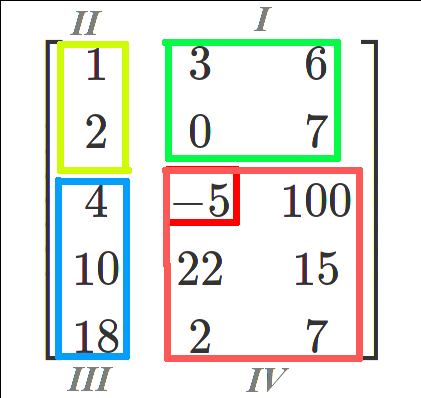
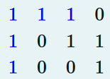
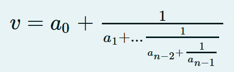
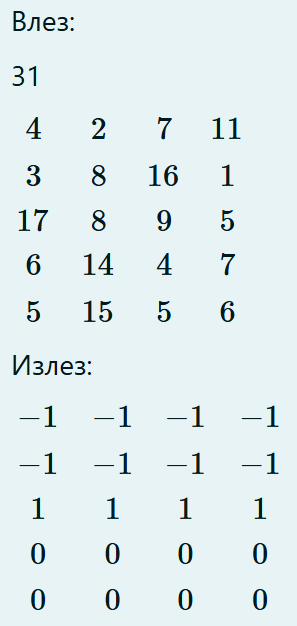
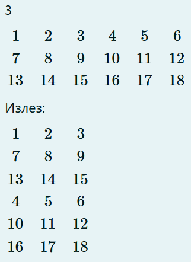
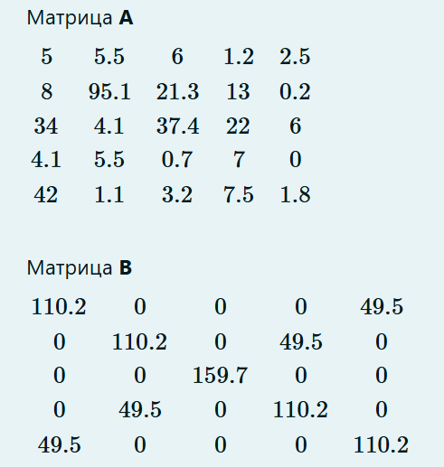

[Main menu](../index.md)

## Zad 1 - [Click here for solution](./task_1.cpp)
Се внесуваат низи од значи од стандарден влез. Да се избројат и испечатат сите последнователни појавувања на соседни самогласки во речениците. Појавата на големи и мали букви да се игнорира. Пронајдените парови самогласки да се испечатат на екран, секој во нов ред со мали букви. Потоа во нов ред се печати бројот на појавувања на паровите самогласки. Читањето завршува кога ќе се прочита знакот #.

Пример:

```
IO is short for Input Output
medioio medIo song
```
#
Излез:

```
io
ou
io
oi
io
io
```

6

For example:

```
Input	
Why so serious?
#
Result
io
ou
2
```

## Zad 2 - [Click here for solution](./task_2.cpp)
На стандарден влез се дадени повеќе редови со броеви така што секој ред започнува со еден цел број (N>=1) што означува колку броеви следуваат по него во истиот ред. Да се напише програма која на СИ за секој ред ќе го испечати бројот со најголема најзначајна цифра. Читањето на броеви завршува кога ќе се прочита бројот 0.

For example:

```
Input
9 783 493308 235452 54512 21055 406963 238857 412436 105422
13 403542 419503 80868 359387 261580 185590 395911 162138 67383 77614 69892 401246 288229
14 304712 410644 426231 379425 316565 238331 19975 106894 186458 87232 25590 15905 361939 243918
14 279986 269509 454513 279651 402478 102024 352123 2368 419681 175537 344481 245274 386202 253511
10 184003 373047 196320 23140 271386 258331 120056 7056 406853 495096
12 252925 76737 359079 327718 155198 91160 345660 484283 57435 132002 328732 204396
9 83955 182111 13934 259 475929 497406 199988 488479 36223
14 292656 375762 324259 182763 157996 232129 174662 383406 204707 489247 30978 295158 151592 273983
14 165728 53588 226975 499549 404240 480166 405416 209158 392604 414324 316692 38033 190455 353658
7 267346 451955 1650 237326 439703 144396 339916
15 394337 324355 390790 315316 210095 31972 231564 384467 381232 328605 479170 1138 254088 125861 80858
6 188500 250066 130499 445641 229614 448326
8 260542 343029 299849 479534 416032 400550 356613 275848
6 440170 26370 335351 404196 90373 351413
7 277986 366877 422447 247635 415753 95474 126662
9 231879 363144 332143 285817 181134 442024 246183 469572 447757
13 339474 249329 47214 20251 417072 245145 336733 145268 305273 304339 386339 266762 161026
7 386002 481418 178275 447464 300355 176770 448954
13 171186 397247 194399 60219 50293 436724 166095 85623 212362 183817 875 189220 59683
15 449180 371458 260639 375685 329595 383071 62070 96255 164039 349415 467864 264109 305256 216162 475478
0

RESULT
783
80868
87232
454513
7056
91160
83955
489247
53588
451955
80858
445641
479534
90373
95474
442024
47214
481418
85623
96255
```

## Zad 3 - [Click here for solution](./task_3.cpp)
Од тастатура во низа се внесуваат N позитивни цели броеви (N <= 100), а потоа се внесува и цел број ind (ind >= 0).

Да се напише функција sum_pos која ја прима низата, бројот ind (кој претставува индекс во низата) и бројот на валидни елементи во низата. Функцијата треба да врати сумата на сите елементи почнувајќи од дадениот индекс ind па се до крајот на низата. Ако индексот ind е поголем од Nфункцијата треба да врати 0.

НАПОМЕНА: Задачата да се реши со помош на покажувачи (без користење на оператор [ ]).

Пример

влез:
```
10
2 4 6 8 1 3 9 12 33 44
6
```
излез:

```
98
98 = 9+12+33+44
```

For example:
```
Input	
6
2 1 66 100 1 2
5

Result
2
```

## Zad 4 - [Click here for solution](./task_4.cpp)
Еден елемент од матрица ја дели матрицата на 4 квадранти (прикажани на сликата). Притоа самиот елемент кој ја дели матрицата припаѓа во четвртиот квадрант (-5 во примерот на сликата).

Од стандарден влез се внесува матрица со димензии NxM (1 <= N, M < 100). Потоа се внесуваат два броеви кои претставуваат индекси на еден елемент од матрицата.

Да се најдат сумите на секој од квадрантите и да се испечатат на стандарен излез. Притоа се печати сумата за првиот квадрант, па за вториот, па третиот и на крај за четвртиот. Доколку не може да се креира квадрант, тогаш за сумата на тој квадрант треба да се испечати 0.



For example:

```
Input	
2 3
5 7 8
1 2 3
1 1

Result
15 5 1 5
```
## Zad 5 - [Click here for solution](./task_5.cpp)
Од стандарден влез се чита ливче во спортска обложувалница.

Во првиот ред е запишана сумата на уплата (цел број).

Потоа во секој нареден ред кој се чита од стандарден влез (се додека не се прочита знакот #) е запишан по еден тип во следниот формат:

`ab12 1 1.25`

Првиот број е шифрата на типот (низа од знаци која не е подолга од 9 знаци), вториот број е типот (може да биде 1, 0 или 2) додека третиот број е коефициентот (реален број).

Ваша задача е да го испечатите типот со најголем коефициент како и можната добивка на ливчето. Доколку има повеќе типови со ист максимален коефициент, да се испечати првиот.

Можната добивка се пресметува како производ на сите коефициенти со сумата на уплата.

For example:

```
Input	
100
ab12 1 1.2
c234 2 2.0
#

Result
c234 2 2
240

```
## Zad 6 - [Click here for solution](./task_6.cpp)
Да се напише програма која вчитува матрица со димензии MxN (макс. 100x100). На почетокот се внесуваат димензиите на матрицата, а потоа и елементите на матрицата кои се само вредностите 1 и 0. Програмата треба да изброи и отпечати на СИ во колку од редиците и колоните има барем 3 последователни елементи со вредност 1.

Пример:


 
1 ред + 1 колона = 2

For example:

```
Input
3 8
0 0 1 1 1 0 0 0
1 1 1 0 1 1 1 0
0 1 1 1 1 0 0 1

Result
5
```


## Zad 7 - [Click here for solution](./task_7.cpp)
Од тастатура се внесуваат димензиите на една матрица (m, n <= 100), а потоа и елементите од матрицата. Да се генерира низа (со најмногу m) така што секој елемент од низата се добива со наоѓање на елементот во секоја редица од матрицата што е најоддалечен од аритметичката средина во рамки на таа редица. Ако постојат повеќе елементи што се најоддалечени од аритметичката средина, тогаш се зема предвид првиот. Редоследот на запишување на елементите во низата одговара на редоследот на редиците.

Пример:

Влез:

```
3 6
1 2 2 3 4 5
1 1 2 2 3 3
1 2 3 4 5 6
```

Излез:

`5 1 1`


For example:

```
Input	
4
4
1
2
3
4
5
6
7
8
9
8
7
6
5
4
3
2

Result
1 5 9 5 
```


## Zad 8 - [Click here for solution](./task_8.cpp)
Од стандарден влез се читаат непознат број на редови додека не се прочита 0. Да се најде најдолгиот ред во кој има барем 2 цифри. Потоа, на стандарден излез да се испечатат знаците од најдолгиот ред кои се наоѓаат помеѓу првата и последната цифра (заедно со тие 2 цифри) во истиот редослед. Доколку има повеќе такви редови се печати последниот. Се претпоставува дека ниту еден ред не е подолг од 100 знаци.

Пример.

```
Влез: 
dat.txt:
    aaa123aa222aa2aaa23aaaaa22
    aaaaaaaaaaaa 23aaaa
    123 aaa aaa aaa aaa 12345 aaa aaa 2a
    0
Излез:
    123 aaa aaa aaa aaa 12345 aaa aaa 2

```
For example:

```
Input	
aaa123aa222aa2aaa23aaaaa22 11112 222311111
aaa123aa222aa2aaa23aaaaa22 11112 aaaaaaaa1
aaa123aa222aa2aaa23aaaaa22 11112 2a23111a1
aaa123aa222aa2aaa23aaaaa22 11112 222311aa1
aaa123aa222aa2aaa23aaaaa22 11112 222311111
aaa123aa222aa2aaa21aa11122 11112 aaaa11111
1aaaaaaaaaaaaaaaaaaaaaaaaaaaaaaaaaaaaaaaaa
0

Result
123aa222aa2aaa21aa11122 11112 aaaa11111
```

## Zad 9 - [Click here for solution](./task_9.cpp)
Да се имплементира рекурзивна функција која за низа од цели броеви $[a{0}, a{1}, ..., a_{n-1}]$ ќе ја пресмета вредноста на непрекинатата дропка дефинирана како:



Да се напише програма во која се чита цел број N, по што се читаат елементите на низа од N цели броеви (не повеќе од 100). Потоа се повикува рекурзивната функција и се печати резултатот во нов ред.

For example:

```
Input
50 50 8 43 32 29 4 23 26 17 16 30 16 20 42 41 24 36 27 38 43 22 10 27 14 48 21 20 40 36 13 10 28 33 3 8 3 6 49 23 23 12 31 37 33 12 47 32 42 16 1

Result
50.1246
```
## Zad 10 - [Click here for solution](./task_10.cpp)
Од стандарден влез прво се читаат два знака z1 и z2 , а потоа се читаат редови со низи од знаци се’ додека не се прочита знакот # (секој од редовите не е подолг од 80 знаци).

Да се напише програма со која на стандарден излез ќе се испечатат поднизите од секој ред составени од знаците што се наоѓаат меѓу z1 и z2 (без нив). Секоја подниза се печати во нов ред.

Се смета дека секој ред од датотеката точно еднаш ги содржи знаците z1 и z2, знакот z1 секогаш се наоѓа пред знакот z2, а меѓу z1 и z2 секогаш има барем еден знак.

For example:

```
Input	
0 9
nfjskdz0nvjkfdmnlks9bvfkjmcdz,
bfhjdskvfdkl0fvkdzddjmje k dmkldz kdfds!%mlacsd9
0fbnrjkdn9
fjkd0jdfkfmjndksfjd;sj sad;jm 9nfcjka
#

Result
nvjkfdmnlks
fvkdzddjmje k dmkldz kdfds!%mlacsd
fbnrjkdn
jdfkfmjndksfjd;sj sad;jm 
```

## Zad 11 - [Click here for solution](./task_11.cpp)
Од стандарден влез се читаат низи од знаци се додека не се прочита знакот #. Да се напише програма во која од за секој прочитан ред ќе се отпечати бројот на цифри во тој ред, знакот :, па самите цифри подредени според ASCII кодот во растечки редослед. Низите од знаци не се подолги од 100 знаци.

For example:

```
Input	
74I9BjpbhbsfX6Ai0xtnmv4csz2gNv
wtkb3Y82B9oygnG1vhRsMOuman2n894v08w4pI3e4x
p7A3pO1U70aeGxwpOptb2rie
nw01MAok4HWisf913hjtiyscgwhdr7w92lm7eddhy6ne40fHbsZc3ac
Zmwk1yrnqt0LjT6ItS2kH
kfcp3Xpxx030B0ojf2G2o4JgkTsolbxqgxkifmbwrxRevKum8tvq4FZxi9LsUM2bq3jGjuo0eu4iv6
W79qURXz32tn8gdzAmasf019JdFbVtizbwu1t09dlkLfpxF1dw7g4wqHSLgEojK27bYP
wyqzCunXvicN1D31v41hbhvmC45m69u587aW0gAZ4mvhypshmn0kVs
#

Result
7:0244679
14:01223344488899
6:012377
14:00112334467799
4:0126
16:0000222333444689
16:0011122347778999
15:001113444556789
```

## Zad 12 - [Click here for solution](./task_12.cpp)
Да се напише рекурзивна функција која ќе го најде бројот на позитивни броеви од целобројна низа. Функцијата како аргумент ја прима низата, за која се бара бројот на позитивни броеви и вкупниот број на елементи, кои ги има таа низа. Функцијата е зададена со следниот прототип:

`int BrojPozitivni(int niza[], int n);`

Да се напише и функција main() за тестирање на функцијата BrojPozitivni.

For example:
```
Input	
2
-2
5

Result
1
```

## Zad 13 - [Click here for solution](./task_13.cpp)
Oд стандарден влез се вчитува еден цел број X, димензии на матрица M и N (цели броеви), како и елементите на матрицата со димензии M x N (цели броеви). Да се напише програма што ќе ги промени редиците на матрицата на следниот начин:

Ако збирот на елементите од редот е поголем од X, елементите на тој ред добиваат вредност 1

Ако збирот на елементите од редот е помал од X, елементите на тој ред добиваат вредност -1

Ако збирот на елементите од редот е еднаков на X, елементите на тој ред добиваат вредност 0

Променетата матрица да се испечати на екран.

Пример:



For example:
```
Input	
17
4 6
1 5 7 2 1 1
10 0 0 5 1 1
5 8 3 9 1 0
9 8 2 5 3 4
Result
0 0 0 0 0 0 
0 0 0 0 0 0 
1 1 1 1 1 1 
1 1 1 1 1 1 

```
## Zad 14 - [Click here for solution](./task_14.cpp)
Да се напише програма во која се вчитува матрица од цели броеви A со N редици и N * 2 колони (N не е поголемо од 50). Програмата треба да ја трансформира вчитаната матрица во нова матрица B, така што сите елементи десно од N-тата колона ќе ги префрли под N-тата редица, односно од матрица со димензија N редици и 2 * N колони ќе се добие матрица со 2 * N редици x N колони.


Пример за N = 3 Влез:



For example:
```
Input
8
62  46  55  83  86  67  19  67  21  90  8  19  37  39  45  54 
2  67  75  82  4  85  28  36  37  48  85  76  59  20  99  100 
21  68  90  22  6  62  69  54  49  52  31  69  40  35  87  3 
41  26  3  10  19  93  47  19  16  22  32  8  8  63  94  49 
20  67  79  73  13  11  64  75  98  47  7  19  14  67  11  84 
5  40  13  42  61  19  61  11  92  93  45  54  74  54  34  94 
54  70  86  29  60  27  12  25  41  63  45  32  67  7  38  51 
61  94  98  61  6  11  100  90  82  11  27  99  65  35  1  57

Result
62 46 55 83 86 67 19 67 
2 67 75 82 4 85 28 36 
21 68 90 22 6 62 69 54 
41 26 3 10 19 93 47 19 
20 67 79 73 13 11 64 75 
5 40 13 42 61 19 61 11 
54 70 86 29 60 27 12 25 
61 94 98 61 6 11 100 90 
21 90 8 19 37 39 45 54 
37 48 85 76 59 20 99 100 
49 52 31 69 40 35 87 3 
16 22 32 8 8 63 94 49 
98 47 7 19 14 67 11 84 
92 93 45 54 74 54 34 94 
41 63 45 32 67 7 38 51 
82 11 27 99 65 35 1 57 
```

## Zad 15 - [Click here for solution](./task_15.cpp)
За еден природен број а велиме дека е порамнување на друг природен број b ако и само ако цифрите еднакви на 9 во бројот b се заменети со цифрата 7 во бројот а.

Пример. Бројот 734775 е порамнување на бројот 934795.

Од стандарден влез се внесуваат непознат број на цели броеви (не повеќе од 100), се додека не се внесе нешто што не може да се интерпретира како цел број.

Ваша задача е да ги отпечатите најмалите 5 од порамнувањата на сите внесени броеви, по редослед од најмалиот кон најголемиот.

Забелешка: Доколку се внесат помалку од 5 броеви, тогаш печатите толку броеви колку што се соодветно внесени.

Наоѓањето на порамнувањето на даден број треба да се реализира во посебна рекурзивна функција poramnet(int a).

Пример.

За броевите: 9592, 69403, 100007, 6, 987, 6977, 33439,

треба да се најдат нивните порамнувања ( тоа се: 7572, 67403, 100007, 6, 787, 6777 и 33437, соодветно),

и да се отпечатат најмалите 5 од нив по овој редослед: 6 787 6777 7572 33437.

ЗАБРАНЕТО е користење на глобални променливи.

For example:
```
Input	
5
6
8
9
9
9
9
y

Result
5 6 7 7 7 
```

## Zad 16 - [Click here for solution](./task_16.cpp)
Да се напише рекурзивна функција за наоѓање на максималната цифра од даден цел број.

Од стандарден влез се внесуваат непознат број цели броеви се додека не се внесе нешто што не е број. За секој од нив да се испечати максималната цифра во посебен ред.

Забелешка: Решението со рекурзивна функција носи 100% од поените, а со нерекурзивна функција 70% од поените.

Забелешка: ЗАБРАНЕТО е користење на глобални променливи.

For example:
```
Input
5128
4126
7258
4000
4500
6882
7762
3900
4100
4400
4897
6000
7000
7500
8002
3000
3910
4090
4110
4202
4490
4800
5000
5990
6500
6905
7010
7400
7600
8000
8005
2999
3001
3905
3999
5128
4126
7258
4000
4500
6882
7762
3900
4100
4400
4897
6000
7000
7500
8002
3000
3910
4090
4110
4202
4490
4800
5000
5990
6500
6905
7010
7400
7600
8000
8005
/


Result

8
6
8
4
5
8
7
9
4
4
9
6
7
7
8
3
9
9
4
4
9
8
5
9
6
9
7
7
7
8
8
9
3
9
9
8
6
8
4
5
8
7
9
4
4
9
6
7
7
8
3
9
9
4
4
9
8
5
9
6
9
7
7
7
8
8
```

## Zad 17 - [Click here for solution](./task_17.cpp)
Од тастатура се внесуваат димензиите на една матрица (m,n <= 100), а потоа и елементите од матрицата. Да се трансформира матрицата така што средниот елемент во секоја редица ќе се замени со разликата (по апсолутна вредност) на сумата на елементите во првата половина од редицата и сумата на елементите во втората половина на редицата. Ако матрицата има парен број колони, се менува вредноста на средните два елемента. Средниот/те елемент/и влегува/ат во сумите (при непарен број на колони, средниот елемент влегува во двете суми!). Да се испечати на екран променетата матрица.

Пример.

Влез:

m = 4

n = 4

1 3 -5 4

2 10 2 10

7 2 3 5

3 2 10 3

Излез:

1 *5* *5* 4

2 *0* *0* 10

7 *1* *1* 5

3 *8* *8* 3

For example:
```
Input
4 5
1 0 0 3 1
0 0 1 2 5
1 2 1 0 0
1 1 0 0 3

Result
1 0 3 3 1 
0 0 7 2 5 
1 2 3 0 0 
1 1 1 0 3 

```
## Zad 18 - [Click here for solution](./task_18.cpp)
За квадратна матрица А со димензии n x n, од стандарден влез се внесува бројот n (n > 2) и елементите на матрицата (реални броеви). Нека X e збирот од елементите под главната дијагонала во матрицата А. Нека Y е збирот од елементите под споредната дијагонала во матрицата А. Да се креира нова матрица B на следниот начин:

сите елементи од главната дијагонала во матрицата B треба да имаат вредност X

сите елементи од споредната дијагонала во матрицата B треба да имаат вредност Y

ако даден елемент припаѓа и на главната и на споредната дијагонала во матрицата B, тогаш неговата вредност e X+Y

сите останати елементи во матрицата B имаат вредност 0

Новата матрица B да се испечати на стандарден излез.



For example:
```
Input	
3
101 202 303
11 22 33
1 2 3

Result
14 0 38
0 52 0
38 0 14
```
## Zad 19 - [Click here for solution](./task_19.cpp)

Од стаднарден влез се читаат N низи од знаци (стрингови) не подолги од 80 знаци. На почетокот на програмата се читаат два цели броеви:

- N - бројот на низи од знаци кои ќе се читаат и

- X - поместување.

- Секоја од вчитаните низи од знаци треба да се трансформира на тој начин што секоја од малите и големите букви (a-z, A-Z) се заменува со истата буква поместена X места понапред во азбуката (a-z). Ако се надмине опсегот на буквите во азбуката, се продолжува циклично од почетокот на азбуката. Трансформираната низа да се отпечати на СИ.

Трансформацијата да се имплементира со посебна рекурзивна функција.

Пример:

Welcome -> трансформирано со поместување 5 -> Bjqhtrj

```
For example:

Input	

16 1
Sheets of empty canvas, untouched sheets of clay
Were laid spread out before me as her body once did.
All of five horizons revolved around her soul as the earth to the sun
Now the air I tasted and breathed has taken a turn
Ooh, and all I taught her was everything
Ooh, I know she gave me all that she was
And now my bitter hands chafe beneath the clouds of what was everything.
Oh, the pictures have all been washed in black, tattooed everything...
I take a walk outside, I'm surrounded by some kids at play
I can feel their laughter, so why do I sear?
Oh, and twisted thoughts that spin round my head, I'm spinning, oh,
I'm spinning, how quick the sun can drop away
And now my bitter hands cradle broken glass of what was everything
All the pictures have all been washed in black, tattooed everything...
All the love gone bad turned my world to black
Tattooed all I see, all that I am, all I'll be... yeah...

Result

Tiffut pg fnquz dbowbt, voupvdife tiffut pg dmbz
Xfsf mbje tqsfbe pvu cfgpsf nf bt ifs cpez podf eje.
Bmm pg gjwf ipsjapot sfwpmwfe bspvoe ifs tpvm bt uif fbsui up uif tvo
Opx uif bjs J ubtufe boe csfbuife ibt ublfo b uvso
Ppi, boe bmm J ubvhiu ifs xbt fwfszuijoh
Ppi, J lopx tif hbwf nf bmm uibu tif xbt
Boe opx nz cjuufs iboet dibgf cfofbui uif dmpvet pg xibu xbt fwfszuijoh.
Pi, uif qjduvsft ibwf bmm cffo xbtife jo cmbdl, ubuuppfe fwfszuijoh...
J ublf b xbml pvutjef, J'n tvsspvoefe cz tpnf ljet bu qmbz
J dbo gffm uifjs mbvhiufs, tp xiz ep J tfbs?
Pi, boe uxjtufe uipvhiut uibu tqjo spvoe nz ifbe, J'n tqjoojoh, pi,
J'n tqjoojoh, ipx rvjdl uif tvo dbo espq bxbz
Boe opx nz cjuufs iboet dsbemf csplfo hmbtt pg xibu xbt fwfszuijoh
Bmm uif qjduvsft ibwf bmm cffo xbtife jo cmbdl, ubuuppfe fwfszuijoh...
Bmm uif mpwf hpof cbe uvsofe nz xpsme up cmbdl
Ubuuppfe bmm J tff, bmm uibu J bn, bmm J'mm cf... zfbi...

```