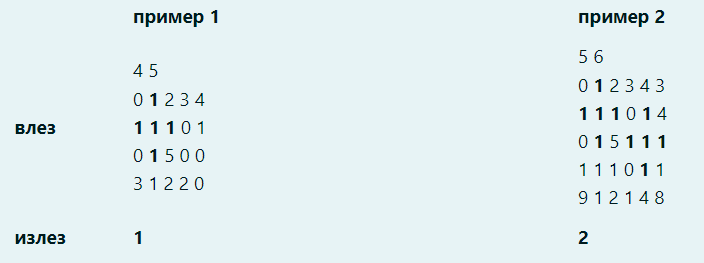

## Matrices

## Task 1

Write a program that, for a matrix entered from the keyboard, calculates the difference between the sum of elements in odd columns and the sum of elements in even rows. The matrix does not have to be square.


## Task 2

Write a program that, for a matrix entered from the keyboard, replaces the elements of the main diagonal with the difference between the maximum and minimum element in the matrix. Print the resulting matrix to the screen.

## Task i

Write a program that, for a matrix entered from the keyboard, replaces the elements of the main diagonal with the difference between the maximum and minimum element in the matrix. Print the resulting matrix to the screen.

Note: You should not consider max and min to be diagonal elements.

For example for the given matrix:
```
3
1 2 3
4 5 6
7 8 9
```
The max and min should be:

`max = 8`

`min = 2`

## Task 3

Write a program that, for a square matrix entered from the keyboard, prints to the screen whether it is symmetric with respect to the main diagonal.

## Task 4

It is necessary to find and count all occurrences of the “X” shape composed only of elements with a value of 1. The “X” shape consists of 5 elements with a value of 1 that are appropriately distributed in the matrix (an element with a value of 1 that has elements with a value of 1 as its diagonal neighbors).

The dimensions of a matrix and its elements are entered from the standard input. Count all occurrences of the “X” shape within the matrix. Assume that there should be no overlap of elements from two “X” shapes (example 2). Occurrences of the “X” shape are sought from left to right and top to bottom.

